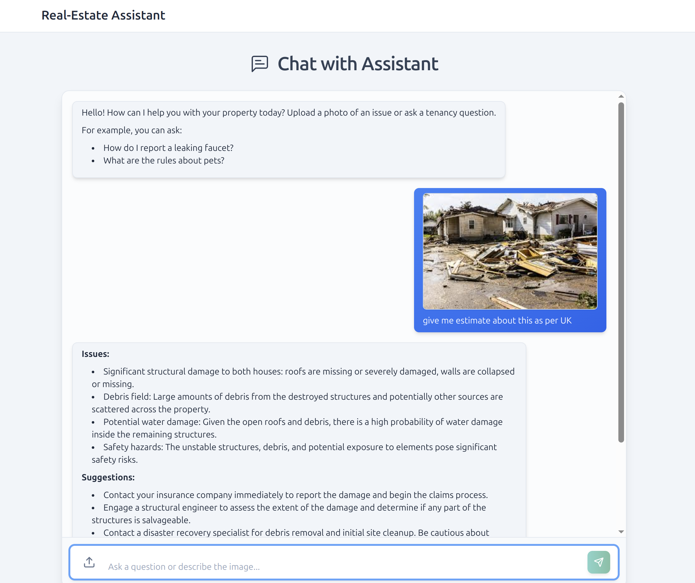

# Multi-Agent Real Estate Assistant Chatbot (Text + Image Enabled)

This project implements a sophisticated chatbot assistant designed to help users with real estate-related issues. It leverages a multimodal AI backend (like Google Gemini), accessed via the `/api/chat` endpoint, to understand both text and image inputs and effectively route queries to specialized virtual agent capabilities.

## Objective

To provide users with a seamless interface for diagnosing property issues (using images and text) and getting answers to common tenancy-related questions. The backend AI model is responsible for:

1.  **Issue Detection & Troubleshooting:** Analyzing uploaded property images (along with text) to identify problems (e.g., mold, cracks, leaks) and suggest potential solutions or next steps.
2.  **Tenancy FAQ:** Answering text-based questions about tenancy laws, agreements, and processes, potentially offering location-specific advice if location context is provided to the AI.

## Example UI



## Backend Routing Logic (`/lib/router.ts`)

The backend employs a simple routing mechanism to direct user requests based on the input provided:

1.  **Image Present:** If the user uploads an image (with or without accompanying text), the request is routed to the **Issue Detection & Troubleshooting Agent** (`analyseIssue`). This agent uses the multimodal capabilities of the AI to analyze the image.
2.  **Text Only:** If the user provides only text (no image), the request is routed to the **Tenancy FAQ Agent** (`answerFAQ`). This agent uses the text input and conversation history to answer tenancy-related questions or indicate if the query is outside its scope.
3.  **Fallback:** If neither text nor an image is provided in the request (which should be rare due to frontend/API validation), a default fallback message asking for more details is returned.

This approach uses the distinct capabilities of the AI model based on the input modality.

## Frontend Features

*   **Multimodal Input:** Accepts both text queries and image uploads.
*   **Interactive Chat UI:** Clean, responsive chat interface built with React and styled with Tailwind CSS.
*   **Image Display:** Uploaded images are displayed directly within the chat message context.
*   **Markdown Rendering:** AI responses are rendered with Markdown support, including:
    *   Lists (ordered and unordered)
    *   Bold/Italic text
    *   Blockquotes
    *   Links
    *   Code Blocks (with syntax highlighting using `react-syntax-highlighter`)
*   **Loading & Animation:** Uses `framer-motion` for smooth animations and loading indicators.
*   **Responsiveness:** Adapts layout and elements for various screen sizes.
*   **Local History:** Chat history is persisted in the browser's `localStorage` for the current session (Note: Uploaded image previews are session-specific and won't be restored from history).

## Technology Stack

*   **Framework:** [Next.js](https://nextjs.org/) (v15+)
*   **Language:** [TypeScript](https://www.typescriptlang.org/)
*   **UI Library:** [React](https://react.dev/) (v19+)
*   **Styling:** [Tailwind CSS](https://tailwindcss.com/) (v3)
*   **Animation:** [Framer Motion](https://www.framer.com/motion/)
*   **Icons:** [Lucide React](https://lucide.dev/)
*   **Markdown:**
    *   [React Markdown](https://github.com/remarkjs/react-markdown)
    *   [Remark GFM](https://github.com/remarkjs/remark-gfm)
*   **Syntax Highlighting:** [React Syntax Highlighter](https://github.com/react-syntax-highlighter/react-syntax-highlighter)
*   **Backend API Client (Assumed):** Likely uses a library like `@google/generative-ai` within the `/api/chat` route to communicate with the multimodal AI.

## Getting Started

1.  **Clone the repository:**
    ```bash
    git clone <repository-url>
    cd <repository-directory>
    ```

2.  **Install dependencies:**
    ```bash
    npm install
    ```

3.  **Set up environment variables:**
    *   Create a `.env` file in the project root.
    *   Add the necessary environment variables, particularly the API key for the backend AI service:
        ```dotenv
        GOOGLE_API_KEY="YOUR_API_KEY"
        # Add any other required variables for the /api/chat endpoint
        ```

4.  **Run the development server:**
    ```bash
    npm run dev
    ```

5.  **Open the application:**
    Open [http://localhost:3000](http://localhost:3000) (or the specified port) in your browser.

**Important Note on API Rate Limits:**

The Google Generative AI API (used by the backend `/api/chat` endpoint) has rate limits, especially on the free tier. For models like `gemini-1.5-pro`, the free limit might be as low as 2 requests per minute.

If you send messages too frequently, you may encounter a `429 Too Many Requests` error. 

*   **Wait:** Simply wait a minute before sending another request.
*   **Check Limits:** Refer to the [official Gemini API rate limit documentation](https://ai.google.dev/gemini-api/docs/rate-limits).
*   **Upgrade:** For higher usage, consider upgrading to a paid Google AI Platform plan.

## API Endpoint

*   `/api/chat`: This Next.js API route handles communication with the backend multimodal AI model. It accepts POST requests containing text and/or image data (likely as `FormData`) and returns the AI's response.
